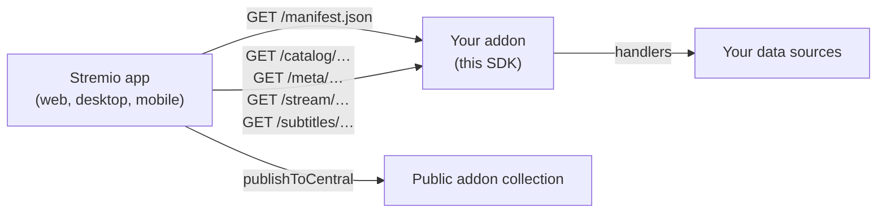

<div align="center">


# Stremio Addon SDK

**Build a [Stremio](https://www.stremio.com) addon in Node.js in minutes.**

[](https://app.travis-ci.com/github/Stremio/stremio-addon-sdk)
[](https://www.npmjs.com/package/stremio-addon-sdk)
[](https://www.npmjs.com/package/stremio-addon-sdk)
[](/LICENSE.md)

**[📚 Documentation](/docs)** · [Addon guide](https://stremio.github.io/stremio-addon-guide) · [Protocol spec](/docs/protocol.md) · [Report a bug](https://github.com/Stremio/stremio-addon-sdk/issues)

</div>

Stremio is a modern media center that discovers, organizes and streams video content through addons. An addon is a small HTTP service that answers a handful of JSON requests: which catalogs it offers, what an item is, and where to stream it from. This SDK gives you the builder, the HTTP server and the publishing tools so you only write the handlers. Stremio runs on Windows, macOS, Linux, Android and iOS, and one addon serves all of them.

## ✨ Features

- 🧱 **Builder API** — declare a manifest, define handlers for catalogs, metadata, streams and subtitles, done
- 🌐 **Serve or embed** — start a server with `serveHTTP`, or mount the addon as an Express router with `getRouter`
- 🔒 **CORS and caching handled** — the SDK sets the headers Stremio expects; you set the cache lifetimes
- 🏠 **Landing page** — every addon gets a homepage with an “Install” button out of the box
- 📣 **Publishing** — `publishToCentral` submits your addon to the [public addon collection](https://api.strem.io/addonscollection.json)
- 🧬 **TypeScript types** — bundled since `1.6.10`, no `@types/stremio-addon-sdk` needed
- 📺 **Live TV guides** — catalogs with a programme schedule render as a native EPG, see [Native EPG](/docs/epg.md)
- ⚙️ **User settings** — addons can ask for configuration through `manifest.config`, see [user data](/docs/api/responses/manifest.md#user-data)

## 🚀 Getting started

You'll need [Node.js](https://nodejs.org) 12 or newer.

### Scaffold an addon

```bash
npm install -g stremio-addon-sdk # use sudo on Linux
addon-bootstrap hello-world
cd hello-world
npm install
npm start -- --launch
```

`addon-bootstrap` asks which [resources and types](/docs/api/README.md) you want to support and generates a working addon. `--launch` opens Stremio Web with the addon installed; use `--install` to install it into the [desktop app](https://www.stremio.com/downloads) instead.

### Or write one by hand

This addon serves a single stream for Big Buck Bunny:

```javascript
const { addonBuilder, serveHTTP, publishToCentral } = require('stremio-addon-sdk')

const builder = new addonBuilder({
    id: 'org.myexampleaddon',
    version: '1.0.0',
    name: 'simple example',
    // Properties that determine when Stremio picks this addon:
    // streams for items of type movie whose id starts with "tt"
    catalogs: [],
    resources: ['stream'],
    types: ['movie'],
    idPrefixes: ['tt']
})

builder.defineStreamHandler(function(args) {
    if (args.type === 'movie' && args.id === 'tt1254207') {
        const stream = { url: 'http://distribution.bbb3d.renderfarming.net/video/mp4/bbb_sunflower_1080p_30fps_normal.mp4' }
        return Promise.resolve({ streams: [stream] })
    }
    return Promise.resolve({ streams: [] })
})

serveHTTP(builder.getInterface(), { port: process.env.PORT || 7000 })
// publishToCentral('https://your-domain/manifest.json') // once the addon is publicly reachable
```

```bash
npm install stremio-addon-sdk
node ./addon.js
```

The process prints a URL you can use to [install the addon in Stremio](/docs/testing.md#how-to-install-addon-in-stremio). Addon URLs must be served over HTTPS with CORS enabled, except for `127.0.0.1`; the SDK handles CORS, HTTPS is up to your host.

## 🛠 How it works

Stremio never runs your code. The app reads your manifest, decides which addons are relevant for a request from their `types`, `idPrefixes` and catalog `extra` filters, and calls the matching resources over HTTP. The SDK turns those calls into handler invocations and turns your return values into protocol-conformant JSON.



| Resource | Handler | Answers |
|---|---|---|
| manifest | the `addonBuilder` constructor | What the addon is and when to call it, see [manifest](/docs/api/responses/manifest.md) |
| catalog | [`defineCatalogHandler`](/docs/api/requests/defineCatalogHandler.md) | Lists of [meta previews](/docs/api/responses/meta.md#meta-preview-object) for the Board, Discover and Search |
| meta | [`defineMetaHandler`](/docs/api/requests/defineMetaHandler.md) | The full [meta object](/docs/api/responses/meta.md) for the details page |
| stream | [`defineStreamHandler`](/docs/api/requests/defineStreamHandler.md) | [Streams](/docs/api/responses/stream.md): HTTP, BitTorrent, YouTube and more |
| subtitles | [`defineSubtitlesHandler`](/docs/api/requests/defineSubtitlesHandler.md) | [Subtitle files](/docs/api/responses/subtitles.md) for a video |
| addon_catalog | [`defineResourceHandler`](/docs/api/requests/defineResourceHandler.md) | A [list of other addons](/docs/api/responses/addon_catalog.md) |

## 📚 Documentation

| Guide | What you'll find |
|---|---|
| [SDK reference](/docs/README.md) | Every export: `addonBuilder`, `serveHTTP`, `getRouter`, `publishToCentral` and the `addonInterface` |
| [Resources](/docs/api/README.md) | How catalogs, metas, videos, streams and subtitles relate, and how Stremio picks an addon |
| [Advanced usage](/docs/advanced.md) | Searching and filtering catalogs, pagination, Cinemeta, user data and configuration pages |
| [Native EPG](/docs/epg.md) | Live TV channels with a programme guide, with a runnable example in [`examples/epg-livetv.js`](/examples/epg-livetv.js) |
| [Deep links](/docs/deep-links.md) | Linking into Stremio with the `stremio://` protocol |
| [Testing](/docs/testing.md) | Trying your addon in the Stremio app and in Stremio Web |
| [Deploying](/docs/deploying/README.md) | Hosting options, with [BeamUp](/docs/deploying/beamup.md) as the recommended one |
| [Examples](/docs/examples.md) | Demo addons, examples in other languages and video tutorials |
| [Protocol spec](/docs/protocol.md) | The HTTP protocol itself, for addons written without this SDK |

The [addon guide](https://stremio.github.io/stremio-addon-guide) walks through building an addon step by step, both with this SDK and in any other language. [addon-helloworld](https://github.com/Stremio/addon-helloworld) is a complete addon to copy from, and the [static addon example](https://github.com/Stremio/stremio-static-addon-example) shows that an addon can be nothing more than JSON files on a web server.

## 🚢 Deploying

An addon has to be reachable on the internet before other people can install it. Deploy it to [BeamUp](/docs/deploying/beamup.md), which we run for this purpose, or to any [Node.js host](/docs/deploying/README.md); for a quick demo from your own machine, [localtunnel](https://github.com/localtunnel/localtunnel) works too.

To get listed in Stremio's community addons, call [`publishToCentral`](/docs/README.md#publishtocentralurl) with your public manifest URL or submit it [through the web form](https://stremio.github.io/stremio-publish-addon/index.html).

## 🧪 Development

For contributors to the SDK itself:

| Command | Description |
|---|---|
| `npm test` | Lint the sources, then run the [tape](https://github.com/tape-testing/tape) suite in [`test/`](/test) |
| `npm run typecheck` | Check the bundled TypeScript declarations |
| `node examples/epg-livetv.js` | Run the live TV example addon |

## 🤝 Contributing

Bug reports and pull requests are welcome — [`good first issue`](https://github.com/Stremio/stremio-addon-sdk/labels/good%20first%20issue) is a good place to start. Documentation lives in [`docs/`](/docs) next to the code, so protocol changes and their docs can land together.

### Migrating from v0.x

- `new addonSDK(manifest)` became `new addonBuilder(manifest)`
- `addon.run(opts)` became `serveHTTP(addon.getInterface(), opts)`
- Handlers return a `Promise` instead of taking a callback

## 🧩 Ecosystem

| Repository | What it is |
|---|---|
| [stremio-web](https://github.com/Stremio/stremio-web) | The web UI that installs and calls your addon |
| [stremio-core](https://github.com/Stremio/stremio-core) | The Rust engine that implements the addon protocol client side |
| [addon-helloworld](https://github.com/Stremio/addon-helloworld) | Reference addon built with this SDK |
| [stremio-static-addon-example](https://github.com/Stremio/stremio-static-addon-example) | An addon made of static JSON files |
| [stremio-addon-sdk-rs](https://github.com/sleeyax/stremio-addon-sdk-rs) | Third-party Rust SDK by Sleeyax, built on stremio-core |
| [go-stremio](https://github.com/Deflix-tv/go-stremio) | Third-party Go SDK by doingodswork |

## 💬 Community

[Website](https://www.stremio.com) · [Blog](https://blog.stremio.com) · [Reddit](https://www.reddit.com/r/Stremio) · [X](https://x.com/stremio) · [Help center](https://stremio.zendesk.com/hc/en-us)

## 📄 License

Copyright © 2019-2026 Smart Code OOD. Released under the MIT license — see [LICENSE](/LICENSE.md).
